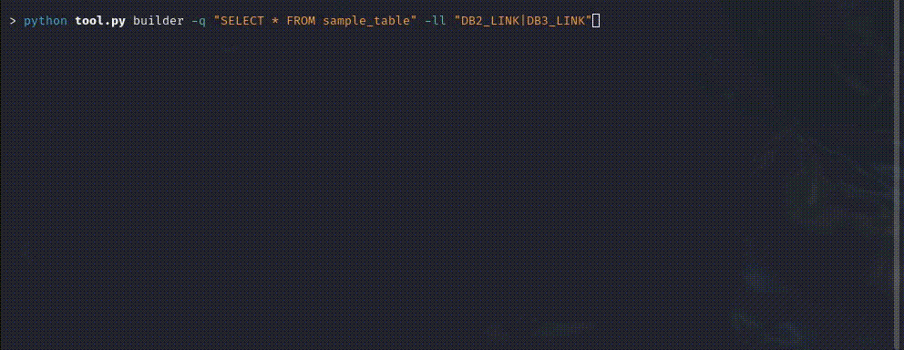
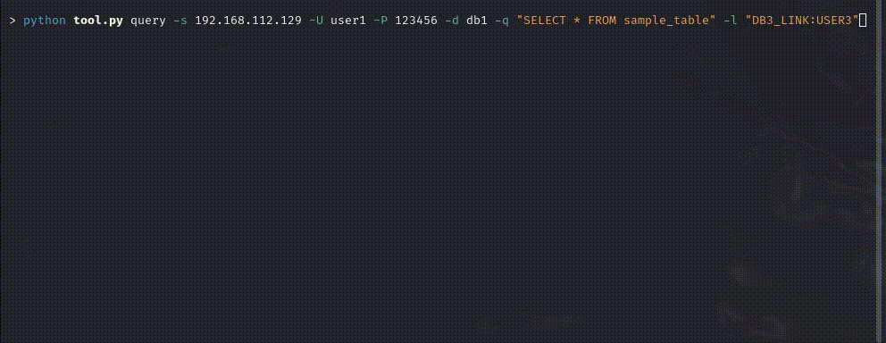

# ORACrawl

ORACrawl is a tool intended to facilitate the exploration of Oracle database DB Links, enabling users to uncover all accessible links, both private and public, by simply providing initial database credentials. It facilitates the execution of various operations on data and schemas across any linked databases. ORACrawl can be utilized by both offensive and defensive security professionals. Offensive users can pivot through databases to escalate the impact of their attacks, while defensive users can assess the reach of any database user within an Oracle database.


## Getting Started


### Installation

ORACrawl requires three dependencies for its full functionality:
```
oracledb
questionary
rich
```
Without these dependencies, only the builder mode will be operational.

To install the dependencies, run one of the following commands inside the `ORACrawl` directory:

```
pip install -r requirements.txt
```
or
```
python -m pip install -r requirements.txt
```

    
### Usage

ORACrawl provides three modes: builder, interactive, and query. The following sections highlight their main use cases and instructions.

#### Builder
The builder mode generates PL/SQL code based on specific inputs such as a list of DB Links and a query. This mode does not connect to the database and cannot validate the availability of the provided DB Links. It is suitable when an SSH connection exists to a system with an existing Oracle SQL client, but where no additional tools can be installed. The generated PL/SQL code can be copied into the client for execution.

```
>python oracrawl.py builder -h
usage: oracrawl.py builder [-h] -q QUERY -ll LINK_LIST

options:
  -h, --help            show this help message and exit
  -ll LINK_LIST, --linkList LINK_LIST
                        Ordered link list, spearated by pipes, to be used by the builder. Format is
                        "DB1_LINK|DB2_LINK"

Query options:
  -q QUERY, --query QUERY
                        The query to be used
```

#### Interactive
The interactive mode provides a user-friendly interface displaying all available DB Links where SQL commands can be executed. Users can select a DB Link and use a shell-like interface to perform arbitrary SQL operations. A server, user, password, and database must be provided to use this mode.

```
>python oracrawl.py interactive -h
usage: oracrawl.py interactive [-h] -s SERVER [-p PORT] -U USER -P PASSWORD -d SID [-e {all,db_links,queries,none}]
                               [-ef {json,csv}] [-ot {pretty,json,csv}]

options:
  -h, --help            show this help message and exit

Connection options:
  -s SERVER, --server SERVER
                        Hostname or IP address of the Oracle server
  -p PORT, --port PORT  Port used by the Oracle server. Default 1521
  -U USER, --username USER
                        Username of the Oracle DB user
  -P PASSWORD, --password PASSWORD
                        Password of the Oracle DB user
  -d SID, --sid SID     Service descriptior for the Oracle DB

Exporting options:
  -e {all,db_links,queries,none}, --export {all,db_links,queries,none}
                        Select what will be exported by the tool. Default is none
  -ef {json,csv}, --export-format {json,csv}
                        Export data format

Display output options:
  -ot {pretty,json,csv}, --output-type {pretty,json,csv}
                        Select how results should be displayed by the tool. Default is pretty
```

#### Query
The query mode is used when DB Links are already known, and the result of a specific query is needed. This mode is useful for automating code execution across several DB Links and gathering the resulting output.

```
>python oracrawl.py query -h
usage: oracrawl.py query [-h] -s SERVER [-p PORT] -U USER -P PASSWORD -d SID -q QUERY [-e {all,db_links,queries,none}]
                         [-ef {json,csv}] [-ot {pretty,json,csv}] [-l LINK]

options:
  -h, --help            show this help message and exit
  -l LINK, --link LINK  Link where the query will be run. Format is "DB_LINK:USER"

Connection options:
  -s SERVER, --server SERVER
                        Hostname or IP address of the Oracle server
  -p PORT, --port PORT  Port used by the Oracle server. Default 1521
  -U USER, --username USER
                        Username of the Oracle DB user
  -P PASSWORD, --password PASSWORD
                        Password of the Oracle DB user
  -d SID, --sid SID     Service descriptior for the Oracle DB

Query options:
  -q QUERY, --query QUERY
                        The query to be used

Exporting options:
  -e {all,db_links,queries,none}, --export {all,db_links,queries,none}
                        Select what will be exported by the tool. Default is none
  -ef {json,csv}, --export-format {json,csv}
                        Export data format

Display output options:
  -ot {pretty,json,csv}, --output-type {pretty,json,csv}
                        Select how results should be displayed by the tool. Default is pretty
```